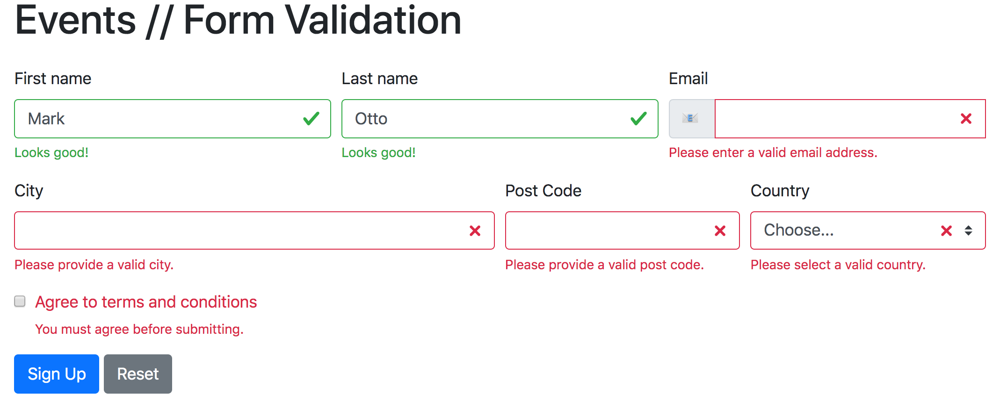

# JS DOM Form Validation Assignment

Да се направи функционалност која ќе ја валидира формата во [`./index.html`](./index.html).

Сите полиња се задолжителни (не смеат да останат непополнети), и секое поле треба соодветно да се валидира ако е пополнето. На пример, вредноста во полето `email` треба да биде валидна е-пошта, за полето `country` мора да биде избрана некоја од понудените опции, полето `Agree to terms and conditions` мора да биде штиклирано итн.

Пораките кои треба да се појавуваат кога има невалидни полиња би треебало да изгледаат како [`./example.html`](./example.html)

Кога ќе се ресетира формата треба да се избришат и праките за грешки, т.е. да се врати формата во првичната состојба.